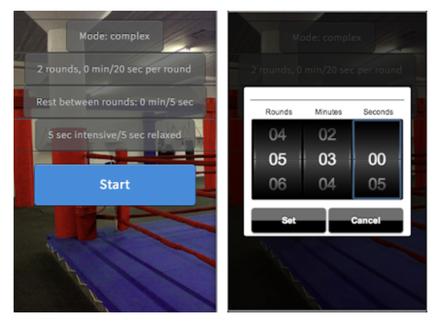

exercise timers as immutable state machines on Typescript

[fsm README.md](fsm/README.md) - core logic

[adapters README.md](adapters/README.md) - stateful OO adapters for OO lib users

[react README.md](react/README.md) - react hook(s)

TODO keywords: immutable/functional, (optionally) deterministic, 0 dependency, timer with time concern separated/abstracted away

TODO reference implementations: react-native, mermaid

TODO reference-metronome

TODO publish properly (when NX really supports it) - or move to pnpm workspaces, publish from there

TODO round end warning time setting https://www.reddit.com/r/amateur_boxing/comments/16f4s7a/theres_a_lot_of_boxing_timer_apps_out_there_is/

TODO warmup time setting

TODO keep-awake - check it closes on stopped; add "exit" button

TODO drum inputs for react-native - Picker 

TODO skip break

TODO allow to stop from running stage

TODO settings storage
