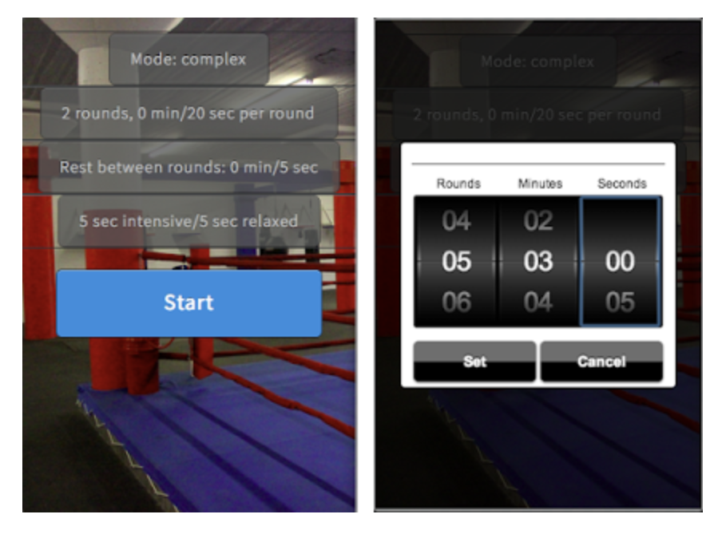

Exercise timers as immutable state machines in TypeScript. Applications own workout
state; pure models return explicit validation results and ordered transition facts.
Optional adapters supply scheduling and framework integration.

```sh
npm ci --ignore-scripts --no-audit --no-fund
npm run check
npm run dev
```

Use Node.js 24. The browser demo runs at http://localhost:4200.
See [maintained commands and runnable examples](docs/development.md),
[core API](fsm/README.md), [optional timer adapter](adapters/README.md),
[workout model](ui/README.md), and [React hooks](react/README.md).
CI checks the documented library/web scope; native and experimental XState
projects retain separate legacy workflows.

TODO keywords: immutable/functional, (optionally) deterministic, 0 dependency, timer with time concern separated/abstracted away

TODO reference implementations: react-native, mermaid

TODO reference-metronome

TODO publish properly (when NX really supports it) - or move to pnpm workspaces, publish from there

TODO round end warning time setting https://www.reddit.com/r/amateur_boxing/comments/16f4s7a/theres_a_lot_of_boxing_timer_apps_out_there_is/

TODO warmup time setting

TODO keep-awake - check it closes on stopped; add "exit" button

TODO drum inputs for react-native - Picker 

TODO skip break

TODO allow to stop from running stage

TODO settings storage
